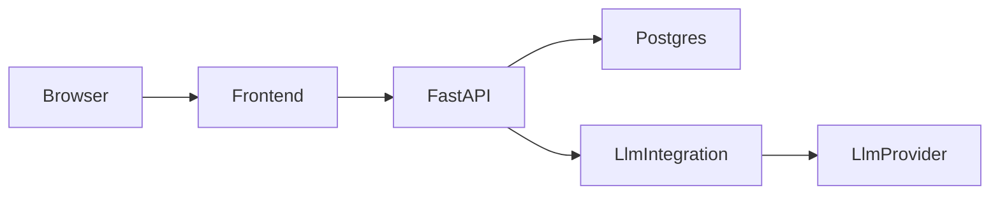

# IELTS Writing Task 2 Architecture

## High-Level Architecture

The system consists of three main layers:

- `frontend`: `React + TypeScript` client application;
- `backend`: `FastAPI` application exposing REST endpoints;
- `database`: `PostgreSQL` for users, prompts, submissions, and analytics.

An external `LLM provider` is used for topic generation and essay scoring.

## Frontend Structure

Suggested client structure:

- `frontend/src/pages`: page containers (`Practice`, `Profile`, `ProfileSettings`, `Auth`);
- `frontend/src/components`: reusable UI components;
- `frontend/src/features/auth`: auth flow;
- `frontend/src/features/practice`: writing session flow;
- `frontend/src/features/history`: submission history and detail views;
- `frontend/src/features/analytics`: score chart logic;
- `frontend/src/api`: API client wrappers;
- `frontend/src/lib`: shared utilities.

## Backend Structure

Suggested server structure:

- `backend/app/main.py`: application bootstrap;
- `backend/app/api`: route modules;
- `backend/app/core`: settings, security, db setup;
- `backend/app/models`: SQLAlchemy models;
- `backend/app/schemas`: Pydantic schemas;
- `backend/app/services`: business services;
- `backend/app/integrations/llm`: adapters and provider factory;
- `backend/app/repositories`: optional persistence layer where useful;
- `backend/app/prompts`: prompt templates;
- `backend/app/tests`: automated tests.

## Request Flow

### Topic Generation

1. Frontend requests a topic.
2. Backend checks source strategy.
3. Backend returns a local preset topic or requests one from the LLM provider.
4. Frontend renders the topic and stores session state.

### Essay Scoring

1. Frontend submits topic, essay text, and timer metadata.
2. Backend validates request and user identity.
3. Backend creates the submission record.
4. Backend loads the scoring prompt template.
5. Backend resolves provider client via factory.
6. Adapter sends the request to the external LLM.
7. Backend validates the structured response.
8. Backend stores scores and analysis.
9. Frontend shows summary and details.

## Pattern Usage

Patterns are applied only where they reduce coupling:

- `Adapter`: normalize external LLM providers;
- `Factory`: choose the provider implementation from config;
- `Repository`: optional for cleaner data access boundaries;
- `Service`: orchestrate business logic around scoring and history.

Patterns intentionally avoided:

- unnecessary frontend abstraction layers;
- overengineered domain modeling for simple CRUD;
- generic base classes without a real reuse need.

## State Ownership

- authentication state: frontend auth store plus secure token handling;
- writing session state: frontend feature state;
- persistent essay history: backend plus database;
- score evaluation truth: backend only.

## Deployment Shape

The first deployment target can be containerized:

- frontend container;
- backend container;
- postgres container.

`Docker Compose` should be sufficient for local development.

For active development, compose runs in hot-reload mode:

- backend container uses `uvicorn --reload` and mounts `backend/app`;
- frontend container mounts `frontend/` and keeps container-local `node_modules`;
- polling file watchers are enabled for stable Windows change detection.
